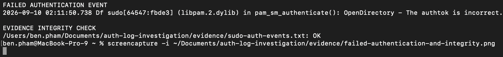

# macOS Local Authentication Log Investigation

## Objective

Investigate a controlled failed authentication attempt followed by successful privileged access. Collect the relevant macOS unified-log evidence, preserve it, verify its integrity, and determine whether the activity should be closed or escalated.

## Environment

- Analyst: Benjamin Pham
- Date: September 10, 2026
- Device: MacBook-Pro-9.local
- Account: ben.pham
- Authentication method: Local sudo password
- Source: Local Terminal
- Source IP: Not applicable because this was not a remote login

## Scenario

An authorized test was performed by entering one intentionally incorrect password during a sudo authentication request. The correct password was then entered, and the `sudo whoami` command returned `root`.

## Timeline

- Before 02:11:50: The user initiated `sudo whoami`.
- 02:11:50.738: macOS recorded `pam_sm_authenticate(): OpenDirectory - The authtok is incorrect`.
- Immediately afterward: The correct password was entered and `sudo whoami` returned `root`, confirming successful privileged access.

## Evidence Collected

- Unified-log export: `evidence/sudo-auth-events.txt`
- Terminal screenshot showing `Sorry, try again.` followed by `root`
- SHA-256 hash: `d5e7f75e6e56b1d6b2cbc94e42a616d99f7256fc4f4a6d072eab4e866dac2d39`
- Integrity verification result: `OK`

## Initial Analysis

The evidence confirms one failed local sudo authentication attempt followed by successful privileged access. A single failed attempt does not establish malicious activity because it may result from an ordinary typing mistake. In this case, the activity occurred during an authorized and controlled test.

## Limitations

The failed attempt was recorded explicitly in the unified log. The successful attempt was confirmed by the Terminal returning `root`, but the filtered log did not provide an equally explicit success message.

## Decision

Close as benign authorized activity. Escalation would be appropriate if repeated failures, an unfamiliar account, unexpected timing, remote access, or suspicious activity after authentication were observed.

## Evidence Screenshot

