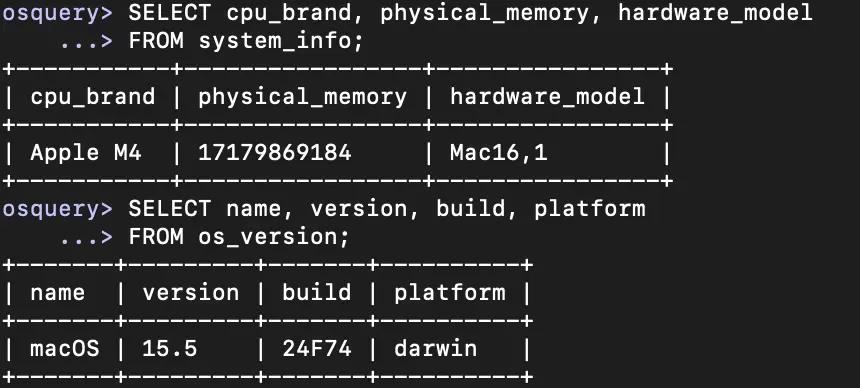

# macOS Threat Hunting with osquery

## Project Overview

This project documents an authorized threat-hunting investigation performed on my own Apple Silicon Mac. I used osquery and native macOS utilities to establish a system baseline, examine processes and listening ports, investigate launchd persistence, validate an unfamiliar executable, inventory Chrome extensions, remediate unwanted software, and verify the results.

The investigation emphasized evidence-based classification: an unfamiliar or poorly signed file deserves investigation, but it should not be labeled malware without sufficient evidence.



## Objectives

* Establish a macOS hardware, operating-system, account, and process baseline
* Correlate listening ports with the processes that opened them
* Identify and investigate third-party launchd persistence
* Evaluate executable identity, code-signing information, file integrity, and reputation
* Inventory browser extensions across user profiles
* Remove unwanted components and verify remediation
* Document findings in an analyst-style report

## Tools and Environment

* osquery
* macOS Terminal
* Native macOS tools: `codesign`, `spctl`, `shasum`, and `find`
* VirusTotal hash search
* Google Chrome extension manager
* Apple M4 Mac (`Mac16,1`) with 16 GB RAM
* macOS 15.5, build `24F74`, Darwin platform

## Investigation Workflow

### 1. System and Account Baseline

I queried system and operating-system information, then reviewed local accounts and active processes. The account inventory contained 131 records, but only one appeared to be a normal human account; the remaining records were expected macOS service and system accounts.

This demonstrated why a large raw account count is not automatically suspicious. Account type, user ID, shell, home directory, and system context must be considered together.

### 2. Process and Network Review

I reviewed active processes and correlated listening ports with process IDs, names, and executable paths. Examples included:

* TCP port `3722` associated with `rapportd` under `/usr/libexec`
* TCP port `5000` associated with macOS Control Center
* UDP port `5353` associated with a Google Chrome Helper process

The process names and executable locations were consistent with expected system and application activity. A familiar name alone was not treated as proof of safety; path, protocol, port, and system context were evaluated together.

### 3. launchd Persistence Investigation

I inspected macOS LaunchAgents and LaunchDaemons and separated Apple-managed entries from third-party entries. An unfamiliar ACE updater was configured through `org.ace.AceUpdater.wake.plist` with a `StartInterval` of 3,600 seconds, meaning it could run once per hour.

The configured executable was located under:

```text
~/Library/Application Support/Ace/AceUpdater/Current/AceUpdater.app/Contents/MacOS/AceUpdater
```

The location and hourly execution schedule justified deeper investigation, but did not prove malicious activity.

### 4. Executable Validation

I examined the ACE updater using multiple evidence sources:

* `codesign` identified the executable as `AceUpdater` but returned no named signing authority and reported `TeamIdentifier=not set`.
* `spctl` reported that the application had no resources even though its signature indicated that resources should be present.
* SHA-256: `4904ad9697f1e468c9a33b568722ac43d4a8d725e74d6565e33d72a425310c4a`
* A VirusTotal hash search returned no matches.

A missing reputation record does not mean that a file is safe or malicious. Based on the available evidence and my decision that the software was no longer wanted, I classified it as an **untrusted and unwanted software remnant**, not confirmed malware.

### 5. Browser Extension Review

I joined `chrome_extensions` with the `users` table to associate browser extensions with the correct macOS account. The first inventory contained 17 rows representing 10 unique extension identifiers; duplicate rows were caused by extension data across Chrome profiles.

The review found five overlapping ad-blocking extensions. I retained the one I intentionally used and removed four redundant extensions through Chrome's extension manager. A follow-up query returned six unique extensions.

This reduced unnecessary browser permissions and attack surface without treating every unfamiliar extension as malicious.

## Remediation and Verification

I removed unwanted ACE, AdGuard, Logi/Logitech, and redundant browser-extension components that I recognized and no longer needed. I then restarted the Mac and performed separate verification checks:

* A refined launchd query returned no targeted persistence entries.
* A process query returned no running ACE updater process.
* A filesystem search returned no matching ACE files in the searched active locations.
* The Chrome extension inventory decreased from 10 to six unique identifiers.

These checks distinguished three separate conditions:

* **File presence:** whether an artifact exists on disk
* **Persistence:** whether it is configured to start automatically
* **Execution:** whether it is currently running

A negative result in one category does not automatically prove that the other two categories are clear.

## Security Significance

This workflow reflects core SOC analyst responsibilities:

* Establishing a normal baseline before judging activity
* Correlating evidence across users, processes, ports, executable paths, persistence, signatures, hashes, and reputation sources
* Distinguishing suspicious indicators from proof of compromise
* Reducing false positives through context and precise queries
* Applying scoped remediation and verifying that it worked
* Recording evidence, reasoning, actions, and limitations

## Key Lessons Learned

* A process name can be spoofed; its path and other context must also be examined.
* A failed or incomplete signature increases uncertainty but does not prove malware.
* No VirusTotal matches means the service lacks a matching record, not that the file is safe.
* Broad keyword searches can create false positives, as unrelated names may contain the same letters.
* Browser-extension rows may repeat across profiles, so unique identifiers matter more than raw row counts.
* Effective remediation includes verification after restarting, not merely deleting an item.

## Ethical Scope

All investigation and remediation were performed on a personally owned Mac. No third-party systems, accounts, or data were accessed.
