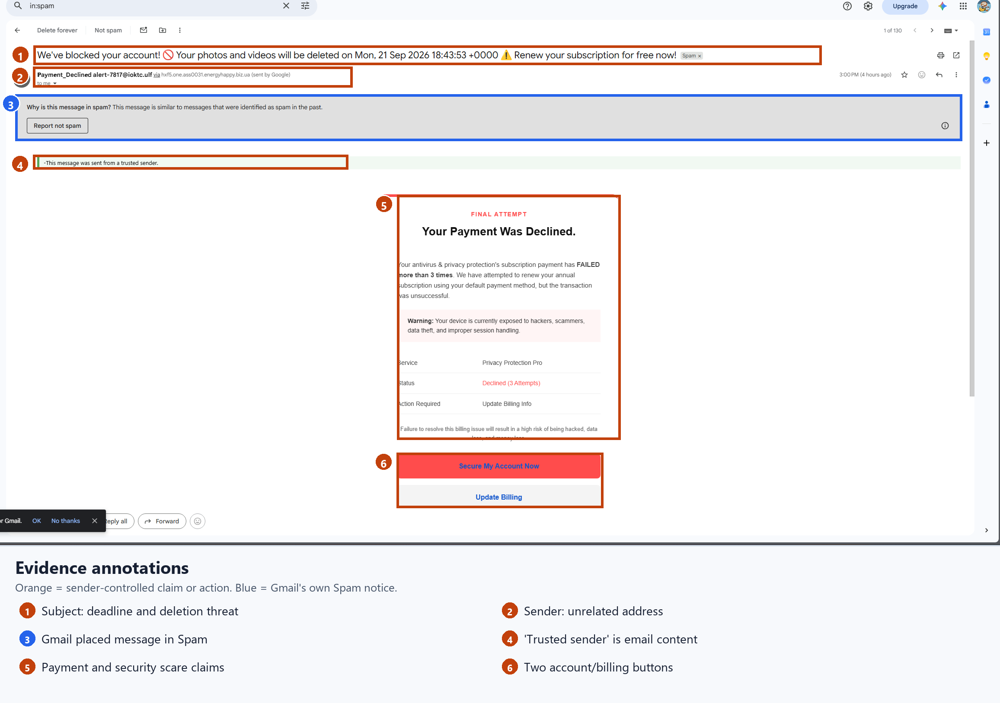
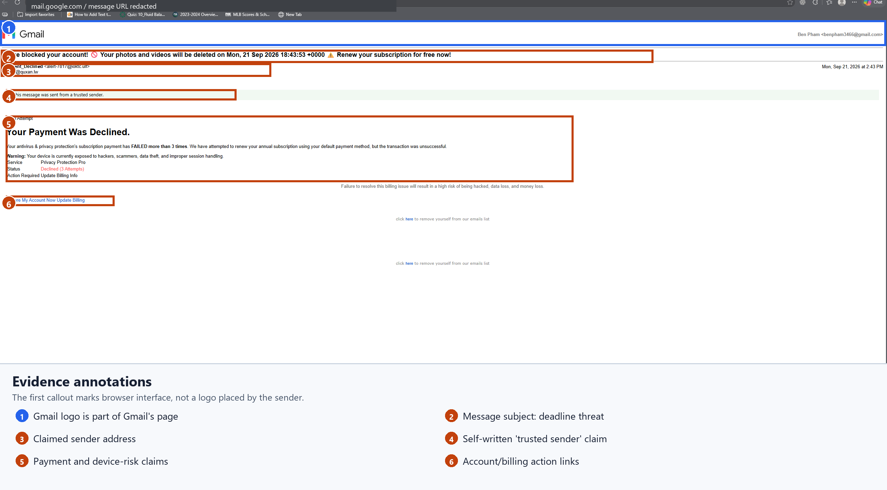

# Phishing email investigation: fake billing warning

**Case type:** Suspicious email in my personal mailbox  
**Date reviewed:** 2026-09-21 (America/New_York)  
**Decision:** Phishing attempt; this email alone does not show a compromise  
**Status:** Closed after reporting the message as phishing in Gmail on 2026-09-21

## Case note

**What came in:** I got an email saying a payment was declined and urging me to act quickly. Gmail placed it in Spam at about 3:00 p.m. EDT on September 21, 2026.

**What I checked:** I saved the email and checked its headers, sender information, and billing links. SPF and DKIM passed for the domain that sent it, but the visible sender did not match a clear subscription provider. Both billing buttons pointed to the same hosted page.

**Decision and action:** I classified the email as a phishing attempt because of the urgent warning, unclear sender, and billing links. I did not click its links. I reported the message as phishing in Gmail on September 21, 2026, documented the decision here, and closed this personal-mailbox case.

**What I could not confirm:** I did not open the destination page, so I do not know what appears after a click, whether it redirects, or what information it asks for. I also did not check a subscription account separately. This email alone does not show that an account or device was compromised.

## Annotated message evidence

Orange boxes mark claims and buttons the sender put in the email. The blue box marks Gmail's Spam warning. I kept the original screenshots unchanged.

The full-message view also shows a Gmail logo. That logo belongs to Gmail's page; it was not placed there by the sender. I masked the private message ID in the browser address bar of this copy.

## Evidence from the original email

| Observation | What it supports | What it does not prove |
| --- | --- | --- |
| Subject warns that photos and videos will be deleted; body says “FINAL ATTEMPT” and claims three failed payments. | The message uses urgency and fear to push action. | The claimed deadline or failed payments are genuine. |
| `From` address is `alert-7817@ioktc.ulf`; message describes only a generic “Privacy Protection Pro” service. | The visible sender does not match an identifiable subscription provider. | Who actually operated the sending infrastructure. |
| A green strip says the message was sent from a “trusted sender.” It is inside the HTML email body. | The sender wrote a trust claim into the message. | Gmail vouched for the sender. |
| Both “Secure My Account Now” and “Update Billing” link to `storage.googleapis.com/strow/strw_v3.html`, with the same long tracking code. | The buttons point to the same hosted page, not a named company's billing site. | What that page displays or asks for when visited. |
| Gmail reports SPF pass for `one.ass0031.energyhappy.biz.ua` and DKIM pass for `HXf5.one.ass0031.energyhappy.biz.ua`. Neither is the visible `From` domain. | Those checks passed for the sending domain. They do not verify the subscription story. | Whether DMARC passed or failed; no DMARC result appeared in the header I checked. |
| Gmail recorded receipt from IP `51.79.188.252` at 2026-09-21 19:00:57 UTC (15:00:57 EDT). | A delivery point and time visible in Gmail's received header. | The sender's identity or physical location. |

The email's `Date` header says 2026-09-21 18:43:53 UTC (2:43:53 p.m. EDT). That time came from the sender, so I did not use it as proof of the delivery time.

## Assessment

**What I saw:** Gmail put the email in Spam. The message used a deletion deadline, claimed to be trusted, and asked for a billing update. Its sender addresses did not match a named service. Both main buttons pointed to the same hosted page.

**What I think it was trying to do:** Get me to follow a fake billing or account process. I did not visit the page, so I cannot describe what it showed.

**My decision:** I classified it as a phishing attempt because the warning pushed me to act quickly, the sender did not match a clear provider, and both buttons pointed to the same unrelated page. I did not open those links. This email does not show a payment, stolen login, malware running, or account compromise.

**What else could explain it:** A real company might use another service to send email and host a billing page. I could not verify a real company or subscription from this message. If I later found a matching bill by going to a provider's site on my own, I would revisit the decision.

## Evidence handling and scope

- The original `.eml` was read locally as data. Its HTML was not displayed as a webpage, and its links were not opened.
- Original `.eml` SHA-256: `9d34b6b03f5cbce37079d0dbdd9aac3168d2de976fd9cd3970e137b05a8e890c`.
- The full tracking query and original `.eml` remain out of this report. The original file is retained privately in Downloads.
- This was an investigation of an email sent to my personal mailbox, not a workplace incident. I spotted the urgent wording and self-written trust claim, saved the email, made the phishing assessment, and reported it in Gmail. I used Codex to help read the headers and links, annotate the screenshots, and edit this write-up. The original email and unannotated screenshots remain private.

[Back to portfolio](../README.md)
