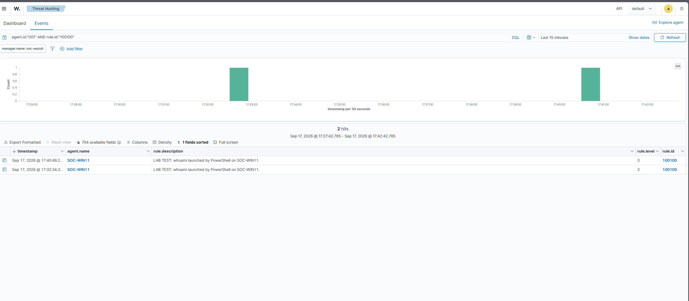
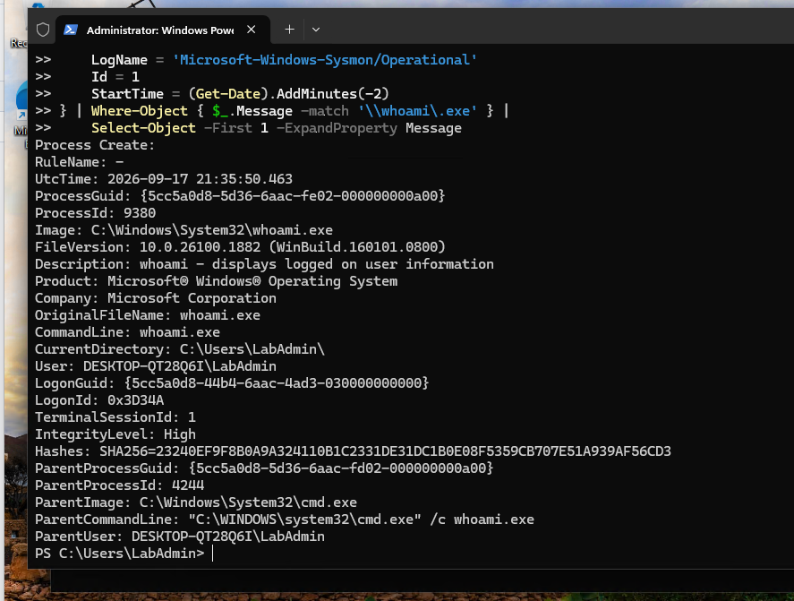

# Investigating a missing Sysmon alert and testing a Wazuh detection

**Author:** Ben Pham  
**Investigation date:** September 17, 2026  
**Scope:** Controlled home lab.

## Outcome

I verified that a fresh `whoami.exe` process event reached Wazuh even though the supplied alert search did not contain a corresponding Windows alert. I then added a narrowly scoped lab rule for `whoami.exe` launched by PowerShell. Two positive tests generated alerts. A test with Command Prompt as the immediate parent produced no matching custom alert, although receipt of that individual negative event was not independently verified.

The activity was intentionally generated in my lab. These tests demonstrated collection and custom alert behavior; they did not establish an attack or production-ready detection coverage.

## Environment

I used Hyper-V on my physical Windows PC to run an Ubuntu 24.04 LTS Wazuh server and a Windows 11 Enterprise evaluation endpoint. The endpoint ran Sysmon and Wazuh agent 4.14.7, registered as SOC-WIN11, agent 001. Its Windows hostname was DESKTOP-QT28Q6I.

I configured source-IP restrictions in Ubuntu's UFW firewall for SSH, dashboard access, and agent connections. I compared SSH host-key fingerprints before connecting and later updated the Windows agent's manager address after DHCP changed the Ubuntu VM's IP. Resource constraints required reducing the Windows VM allocation to 4 GB while keeping the Ubuntu VM at 8 GB.

## Question and investigation decisions

### 1. Was the event missing, or only the alert?

I launched `whoami.exe` and located its process-creation event in Windows's Sysmon log. The exact ProcessGuid search in Wazuh's alert view returned no match. I checked the agent connection, Sysmon collection configuration, broader alert searches, and rule conditions rather than treating an empty search as proof of a broken agent.

Other Sysmon alerts from SOC-WIN11 were searchable, showing that the pipeline could deliver Windows events and produce alerts. This did not prove receipt of my specific test event.

### 2. What did the existing discovery alerts represent?

I traced a separate account-listing event through matching ProcessGuid and ParentProcessGuid values:

```text
wazuh-agent.exe (4292) → net.exe (840) → net1.exe (3236)
```

The command was `net user`, running as SYSTEM from the Wazuh agent directory. The parent chain supported legitimate agent-initiated account enumeration. The exact Wazuh assessment task was not confirmed. I did not treat the alert's discovery label as proof of malicious activity.

### 3. Could the rules explain the difference?

Inspection showed that rule 61603 classifies Sysmon Event 1 at level 0. Rule 92031 matches original filenames `net.exe` or `net1.exe` at level 3. My configured alert-saving threshold was 3. Receiving and decoding an event therefore did not automatically make it a saved alert.

A simplified JSON replay in `wazuh-logtest` decoded as `json` and showed no Phase 3 result. The Windows entry rule required `windows_eventchannel`, so that replay did not reproduce the real Windows rule path. I did not use it to claim a verified final rule or level for the original event.

### 4. Verify receipt using a fresh event

I temporarily enabled `logall_json`, validated the configuration, and restarted the manager. I generated a fresh Windows test and searched the raw-event archive using its ProcessGuid.

| Evidence | Observed value |
|---|---|
| ProcessGuid | `{5cc5a0d8-56f6-6aac-ec02-000000000a00}` |
| Process / PID | `whoami.exe` / 11848 |
| Parent | PowerShell, PID 3124 |
| Event 1 creation time | 2026-09-17 21:09:10.981 UTC |
| Event 5 termination time | 2026-09-17 21:09:11.000 UTC |
| Agent / decoder | 001 / `windows_eventchannel` |

Both records appeared in the manager's archive. This verified receipt of the fresh test.

The alert-file text search also found the GUID, but that result was a different event: server agent 000, sudo rule 5402, recording my own search command. I distinguished the investigator's activity from the Windows event by examining the agent, rule, decoder, and command fields.

After collecting the result, I restored `logall_json` to `no`, passed the configuration check, and confirmed the restarted manager was active.

## Custom lab detection

I preserved the existing local SSH example rule and added rule 100100 in a separate group. I corrected a group-placement error and validated the file before activating it.

```xml
<group name="local,windows,sysmon,lab_test,">
  <rule id="100100" level="3">
    <if_sid>61603</if_sid>
    <field name="win.system.computer" type="pcre2">(?i)^DESKTOP-QT28Q6I$</field>
    <field name="win.eventdata.originalFileName" type="pcre2">(?i)^whoami\.exe$</field>
    <field name="win.eventdata.parentImage" type="pcre2">(?i)\\powershell\.exe$</field>
    <description>LAB TEST: whoami launched by PowerShell on SOC-WIN11.</description>
  </rule>
</group>
```

The rule requires a process-creation event on the named endpoint, an original filename of `whoami.exe`, and an immediate parent path ending in `powershell.exe`. It does not require administrator privileges and does not establish malicious intent. Its deliberate scope also excludes other launchers, including PowerShell 7's `pwsh.exe`.

## Validation

| Test | Action and expected behavior | Observed result |
|---|---|---|
| Positive 1 | Run `whoami.exe` directly from PowerShell; expect rule 100100 | Alert displayed at approximately 21:32:34 UTC |
| Negative | Run `cmd.exe /c whoami.exe`; immediate parent should be cmd.exe, so expect no rule 100100 | Local Sysmon confirmed cmd.exe parent; exact GUID/rule search returned no results |
| Positive 2 | Run `whoami.exe` directly from PowerShell again | New alert displayed at approximately 21:40:49 UTC |

The dashboard displayed Eastern time, four hours behind UTC. Approximate positive times above are converted from its displayed times; exported JSON preserves the full timestamps.

The negative event occurred at 21:35:50.463 UTC, PID 9380, GUID `{5cc5a0d8-5d36-6aac-fe02-000000000a00}`, with cmd.exe PID 4244 as parent. Positive tests before and after it support continuing alert functionality but do not prove that individual negative event reached the manager.

The positive alert GUIDs were `{5cc5a0d8-5c71-6aac-fc02-000000000a00}` and `{5cc5a0d8-5e60-6aac-0603-000000000a00}`. Both exported records were parsed and confirmed as rule 100100, agent 001, with PowerShell parents.

## Verdict and limitations

- Receipt of the fresh pre-rule test was verified using the raw archive and matching ProcessGuid.
- The supplied alert search contained no corresponding Windows alert for that fresh test. The returned sudo alert was investigator activity.
- The new custom rule produced alerts for two intended positive tests, with no matching alert found for the Command Prompt comparison.
- The original historical missing event's receipt and final rule disposition remain unresolved.
- Receipt of the individual negative event was not independently verified, so this is a qualified negative result.
- This guided test does not demonstrate independent mastery, comprehensive discovery detection, or evidence of compromise. Legitimate administration can match the custom rule.

## Evidence preservation

I exported the local rules file, two custom-alert records, and a checksum manifest to Ubuntu's evidence folder. I copied them via SCP to my physical Windows PC and compared SHA-256 hashes with the Ubuntu baselines. Both matched. The hashes verify copy integrity relative to that baseline, not authenticity before collection.

The original rule export, alert JSON, and checksum manifest are retained privately outside the VM. The lab detection is reproduced above for review.

| File | SHA-256 |
|---|---|
| `local_rules-whoami.xml` | `1E57DE39398EFDC8147BAFB66795A969E00A7FDFE7C079341674F6D4A88D94BC` |
| `whoami-rule-100100-alerts.json` | `3C2776EF4B673EC32B5DA6B218F53F6E2E393072A3A277F03DE6C5DD2888E26D` |

The hash manifest covers the rule export and two alert records. It does not cover the separate archive-receipt records or screenshots.

## Screenshots

### Two positive alerts



### Local evidence for the Command Prompt comparison



The second screenshot verifies the comparison event locally; it does not prove manager receipt.

## Assistance and scope

Completed with step-by-step guidance, including command selection, troubleshooting, rule design, test planning, and evidence interpretation. This project records demonstrated lab outcomes without implying independent production experience.

[Return to the lab overview](windows-sysmon-wazuh-lab.md)

## Technical references

- [Wazuh custom rules](https://documentation.wazuh.com/current/user-manual/ruleset/rules/custom.html)
- [Wazuh event logging and archives](https://documentation.wazuh.com/current/user-manual/manager/event-logging.html)
- [Sysmon documentation](https://learn.microsoft.com/en-us/sysinternals/downloads/sysmon)
