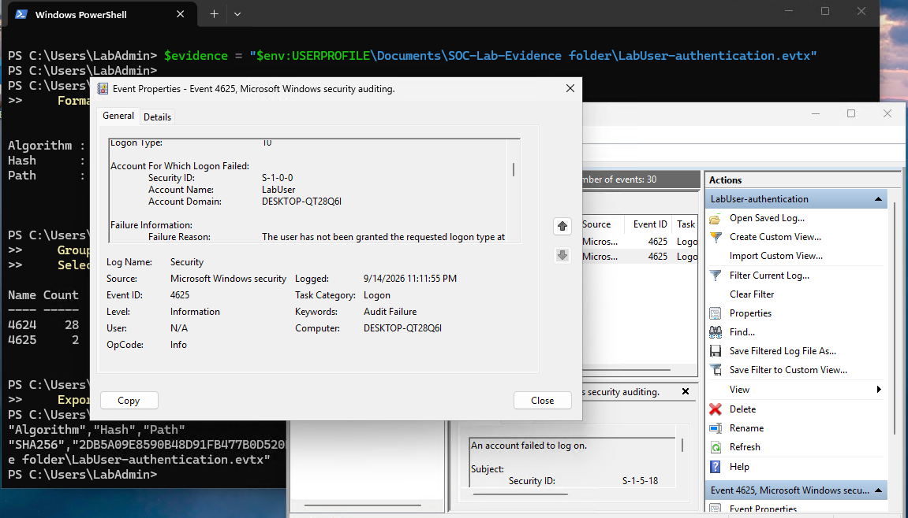
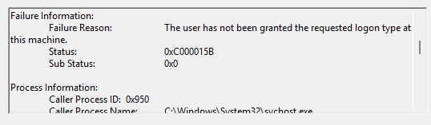
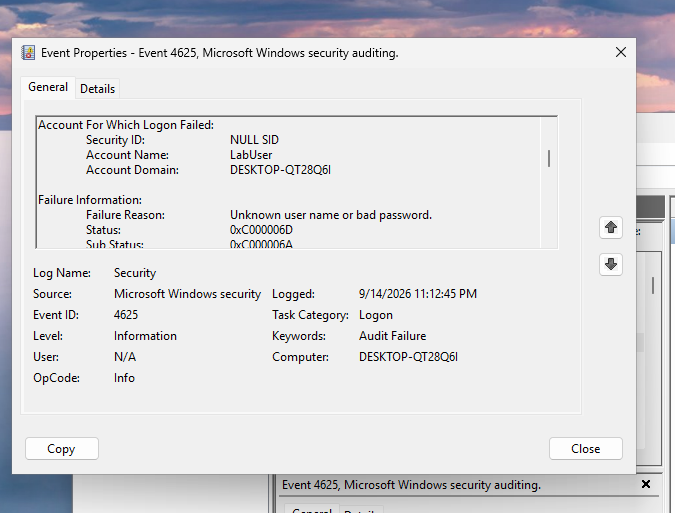
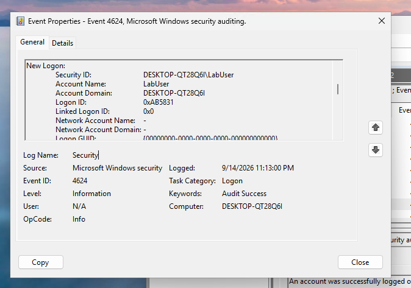
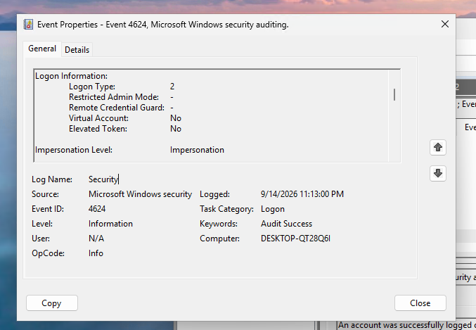
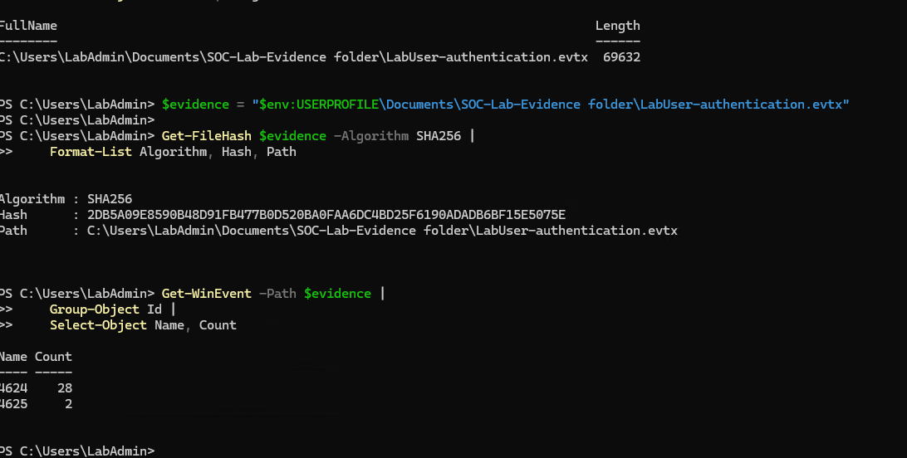

# Part 1 — Windows Authentication Investigation

**Status:** Part 1 completed  
**Project type:** Home SOC lab  
**Tools:** Hyper-V, Windows Event Viewer, PowerShell  
**Scope:** Local Windows Security log investigation; Sysmon, Wazuh, and Sentinel integration are outside this completed phase.

## Summary

I investigated Windows authentication activity generated during an authorized test in my Windows 11 virtual machine. I distinguished a remote sign-in denied because of a missing logon right from a console sign-in rejected because of an incorrect password, then identified the successful console sign-in that followed.

I built a three-event timeline using account fields, logon types, failure codes, event record IDs, and UTC timestamps. I exported the filtered records, checked that PowerShell could read them, and saved a SHA-256 hash for future integrity comparisons.

## Environment and scope

- Hyper-V VM: **SOC-WIN11**, running Windows 11 Enterprise Evaluation.
- Local accounts: **LabAdmin** for lab administration and **LabUser** as the standard test account.
- Log source: **Windows Logs → Security**; provider **Microsoft-Windows-Security-Auditing**.
- Logon auditing reported **Success and Failure**.
- Export filter: event IDs **4624 and 4625**, September 14, 2026, **11:10–11:20 PM** in the VM's displayed time.
- The VM was configured for Pacific Time. The reviewed XML timestamps establish **UTC−07:00** for these displayed events. The physical PC's time zone was not used to interpret them.

## Investigation approach

During setup, LabUser encountered a remote-logon permission restriction through Hyper-V Enhanced Session. I used the basic VM console for the intended local test, deliberately entered an incorrect LabUser password once, and then signed in successfully.

I filtered the Security log and searched for LabUser. I checked the target account rather than assuming the **Subject** account was the user signing in. In failed-logon events, the relevant section was **Account For Which Logon Failed**; in successful events, it was **New Logon**. SYSTEM appearing under Subject did not make it a failed SYSTEM sign-in.

I examined the failure reasons and status codes, then captured **EventRecordID** and **TimeCreated SystemTime** from XML View. Record IDs identify records within the source log; they are not globally unique identifiers.

## Evidence timeline

All three events concern **LabUser**. Local times below are September 14, 2026, Pacific daylight time.

| Local time | UTC timestamp | Event ID | Record ID | Logon type | Finding |
|---|---|---|---|---|---|
| 11:11:55 PM | 2026-09-15T06:11:55.6209966Z | 4625 | 31112 | 10 — RemoteInteractive | Requested logon right missing. Status `0xC000015B`; Sub Status `0x0`. |
| 11:12:45 PM | 2026-09-15T06:12:45.9750837Z | 4625 | 31118 | 2 — Interactive | Incorrect password. Status `0xC000006D`; Sub Status `0xC000006A`. |
| 11:13:00 PM | 2026-09-15T06:13:00.2518327Z | 4624 | 31121 | 2 — Interactive | Successful console sign-in. |

The successful sign-in followed the incorrect-password failure by approximately **14.277 seconds** using XML timestamps, or **15 seconds** using the whole seconds displayed in Event Viewer.

## Findings and assessment

The two failed-logon events had different causes. Record 31112 indicated a logon-right restriction and was consistent with the Enhanced Session error I encountered. Record 31118 indicated an incorrect password during a console sign-in. Record 31121 showed the subsequent successful console sign-in.

I assessed this sequence as consistent with my controlled, authorized lab activity because I performed the test and the account, timing, sequence, and failure reasons matched those actions. An authorized account name, a matching time window, or a particular logon type alone would not establish authorization. These records also do not independently establish the identity or physical location of the person operating the account.

This was an investigation of generated lab activity, not a confirmed malicious incident or a finding that the entire device was free of compromise.

## Evidence preservation and validation

The export was saved **inside the Windows VM**:

```text
C:\Users\LabAdmin\Documents\SOC-Lab-Evidence folder\LabUser-authentication.evtx
```

- File size: **69,632 bytes**.
- Readability check: `Get-WinEvent` successfully read **28 events with ID 4624** and **2 with ID 4625**.
- Those counts cover the filtered export across accounts; they do not represent 30 LabUser attempts.
- Hash record: `LabUser-authentication.evtx.sha256.csv`, saved beside the export and verified by reading its contents.

**SHA-256:**

```text
2DB5A09E8590B48D91FB477B0D520BA0FAA6DC4BD25F6190ADADB6BF15E5075E
```

Commands used for validation:

```powershell
$evidence = "$env:USERPROFILE\Documents\SOC-Lab-Evidence folder\LabUser-authentication.evtx"
Get-Item $evidence | Select-Object Name, Length, LastWriteTime
Get-TimeZone | Select-Object Id, DisplayName
Get-FileHash $evidence -Algorithm SHA256 | Format-List Algorithm, Hash, Path
Get-WinEvent -Path $evidence | Group-Object Id | Select-Object Name, Count
Get-FileHash $evidence -Algorithm SHA256 |
    Export-Csv "$evidence.sha256.csv" -NoTypeInformation
Get-Content "$evidence.sha256.csv"
```

The hash provides a baseline for detecting later changes to the exported bytes. It does not prove the file's authenticity before hashing or establish a formal chain of custody.

## Assistance and limitations

Completed with step-by-step guidance. I performed the test activity, examined the Windows events, and preserved the evidence.

This investigation covered a selected time window and event types, not a comprehensive host investigation. The EVTX, hash CSV, and LocaleMetaData folder were copied to the physical PC. The copied EVTX matched both the original recorded SHA-256 and the saved CSV. Reading the copied log confirmed the event counts and the three timeline records.

## Supporting screenshots

### Remote sign-in restriction



Record 31112: LabUser, Type 10, at 11:11:55 PM. The failure reason identifies a missing logon right.



Additional detail from that event: status 0xC000015B and substatus 0x0.

### Incorrect-password failure



At 11:12:45 PM, the target was LabUser; substatus 0xC000006A identifies an incorrect password.

### Successful console sign-in



New Logon identifies LabUser at 11:13:00 PM.



The same event shows Type 2, supporting the console-sign-in interpretation.

### Export validation



PowerShell read 28 successful-logon records and two failed-logon records from the export and calculated its SHA-256 hash. These counts include all accounts within the export filter.

## Next phase

Sysmon and Wazuh are planned for the next phase and were not used in this investigation. Sentinel remains an optional later extension after reviewing ingestion requirements and costs.

## Reference

[Microsoft: Event 4625 — An account failed to log on](https://learn.microsoft.com/en-us/previous-versions/windows/it-pro/windows-10/security/threat-protection/auditing/event-4625)


