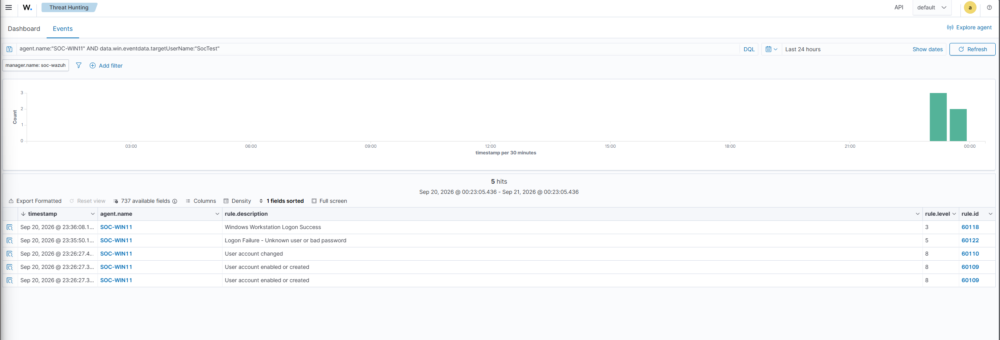

# Windows authentication through Wazuh

**Status:** Completed controlled home-lab investigation.

## What I investigated

I created a standard test account on my Windows VM, made one incorrect-password login attempt, and then logged in successfully. I used Wazuh Threat Hunting to follow the account and login alerts, and checked the Windows Security log to confirm the underlying events and their order.

The account-creation and login sequence could require investigation in a real environment. In this lab, it matched the controlled test I performed.

## Evidence and decision

| Windows event time (UTC) | Event | What it showed |
| --- | ---: | --- |
| 2026-09-21 03:26:25 | 4720 | `LabAdmin` created the local `SocTest` account. |
| 2026-09-21 03:26:25 | 4722 | `LabAdmin` enabled the account. |
| 2026-09-21 03:26:25 | 4738 | `LabAdmin` changed the account. The specific changed field was not confirmed. |
| 2026-09-21 03:35:48 | 4625 | One interactive login for `SocTest` failed because of an incorrect password. |
| 2026-09-21 03:36:06 | 4624 | `SocTest` logged in successfully 18 seconds later. |

Wazuh showed five alerts for the account. I compared them with Windows event IDs and record IDs to distinguish account creation, enablement, change, failure, and success. Both login attempts showed local interactive activity from the same VM (`::1`, logon type `2`). The known test actions confirmed authorization. I classified the alerts as **benign true positives** and documented a close decision for this lab case. I did not treat the same-device source or quick success alone as proof of authorization.

[Read the case note](windows-authentication-through-wazuh-case-note.md) for the disposition, record IDs, timeline, and limits.

## What I learned

An alert describes activity worth reviewing; the analyst still needs to check the underlying event and surrounding context. I also learned to separate Windows event time from the time an alert appeared in Wazuh, and to check time zones before building a timeline.

## Scope and limits

This was a controlled investigation in my own lab, not production SOC work. I performed the test, examined the records, and made the disposition. I received coaching on setup, searching, and review of the note. I confirmed the account and authentication sequence, but did not verify the exact attribute changed in event 4738 or review broader activity after the successful login. The case note links to redacted detail screenshots; original screenshots and detailed host records remain private.

[Back to shared lab overview](windows-sysmon-wazuh-lab.md)
