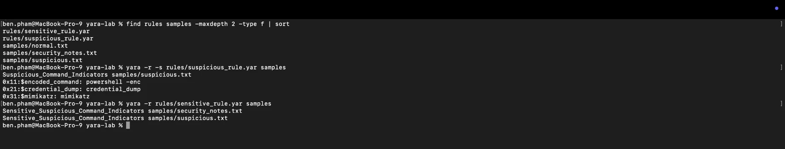

# YARA File Detection and Rule Tuning

## Project Overview

This guided lab demonstrates how YARA rules can identify text-based indicators, how condition thresholds affect detection quality, and why scan scope matters. I created two rules and tested them against three harmless local text samples on an Apple Silicon Mac.

No malware, credential-dumping utility, or executable payload was downloaded or executed. Names associated with suspicious activity appeared only as inert text strings created for detection testing.



## Objectives

- Install and verify YARA on Apple Silicon macOS
- Create a rule containing multiple case-insensitive string indicators
- Compare `2 of them` with `any of them`
- Use `-s` to identify the strings and offsets responsible for a match
- Distinguish a true positive from a contextual false positive
- Prevent self-matches by separating rules from scan targets
- Document observations, conclusions, and limitations

## Tools and Environment

- YARA 4.5.8
- macOS Terminal
- Homebrew
- Apple Silicon Mac
- Harmless text files created specifically for this lab

## Lab Structure

```text
yara-lab/
├── rules/
│   ├── sensitive_rule.yar
│   └── suspicious_rule.yar
└── samples/
    ├── normal.txt
    ├── security_notes.txt
    └── suspicious.txt
```

Keeping rules outside the sample directory ensures that recursive scans inspect only intended evidence. A YARA source file naturally contains its own search strings, so scanning it can cause the rule to match itself.

## Rule Design

The selective rule searches case-insensitively for three text indicators and requires at least two to occur in the same file:

```yara
rule Suspicious_Command_Indicators
{
    meta:
        author = "Benjamin Pham"
        description = "Detects multiple suspicious command indicators in training files"

    strings:
        $encoded_command = "powershell -enc" nocase
        $credential_dump = "credential_dump" nocase
        $mimikatz = "mimikatz" nocase

    condition:
        2 of them
}
```

The comparison rule uses the same strings but changes the threshold:

```yara
condition:
    any of them
```

The `nocase` modifier permits a match regardless of capitalization. The condition determines how many defined strings must be present before the rule triggers.

## Harmless Test Data

| File | Contents and purpose |
|---|---|
| `normal.txt` | Ordinary report text with no indicators |
| `suspicious.txt` | A training string containing all three indicators |
| `security_notes.txt` | An educational sentence mentioning Mimikatz once |

## Results

### Selective rule: `2 of them`

```bash
yara -r -s rules/suspicious_rule.yar samples
```

Only `samples/suspicious.txt` matched. The `-s` output identified all three strings and their hexadecimal offsets:

```text
0x11:$encoded_command: powershell -enc
0x21:$credential_dump: credential_dump
0x31:$mimikatz: mimikatz
```

### Sensitive rule: `any of them`

```bash
yara -r rules/sensitive_rule.yar samples
```

This rule matched both `suspicious.txt` and `security_notes.txt`. The notes file triggered solely because it contained the word `Mimikatz`, even though its context was educational.

| Rule condition | Suspicious sample | Security notes | Normal sample |
|---|---:|---:|---:|
| `2 of them` | Match | No match | No match |
| `any of them` | Match | Match | No match |

## False-Positive and Scope Analysis

The `security_notes.txt` result demonstrates that a YARA match is not proof of malware. It proves only that the rule's condition was satisfied. An analyst must examine file context, origin, type, behavior, and related evidence before classifying it.

An early recursive scan targeted the entire lab directory. Both rule files appeared as matches because their source code contained the exact indicator strings. I corrected this by placing rules and samples in separate directories and scanning only `samples/`.

Requiring two indicators improved precision in this controlled dataset, but it could miss a genuinely suspicious file containing only one indicator. Rule tuning therefore balances:

- **Sensitivity:** detecting more potentially relevant files
- **Specificity:** avoiding irrelevant matches
- **Context:** deciding what a match actually means

## Security Significance

This workflow reflects several SOC and detection-engineering responsibilities:

- Translating suspicious indicators into repeatable detection logic
- Validating rules against positive and negative test data
- Investigating false positives instead of treating every alert as malicious
- Tuning thresholds based on evidence
- Controlling scan scope
- Recording exact matches and limitations

## Key Lessons Learned

- YARA identifies patterns; it does not independently determine intent or prove malware.
- `nocase` makes text matching case-insensitive.
- `2 of them` requires any two defined strings in one scanned file.
- `any of them` improves sensitivity but can increase false positives.
- Rule files should not be mixed with scan targets.
- Detection results require human investigation and contextual evidence.

## Ethical Scope

All files were harmless text samples created locally for this exercise. No real malware was acquired or executed, and no third-party system, account, or data was accessed.
